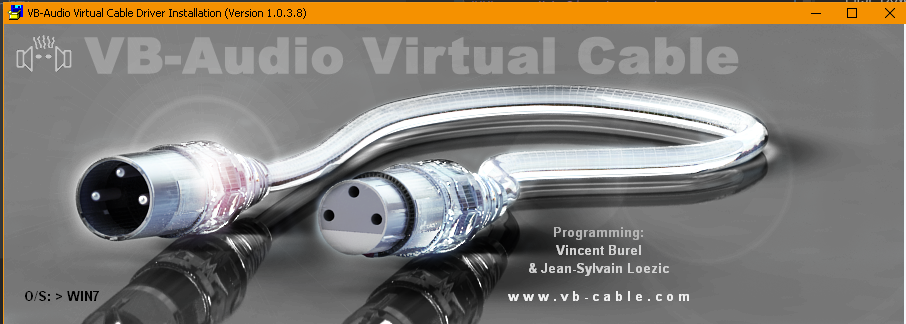
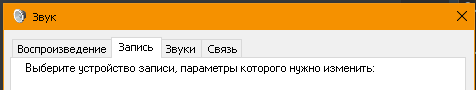
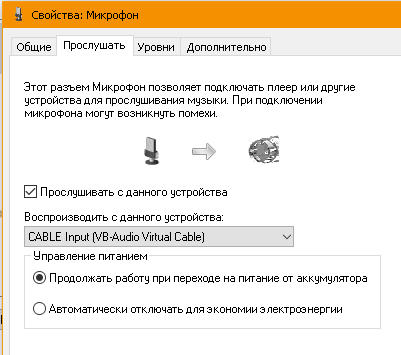
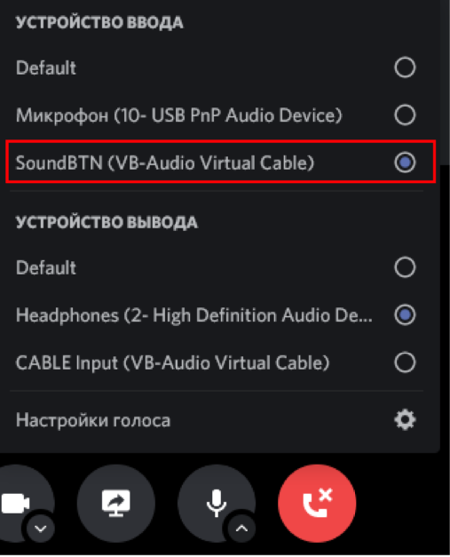
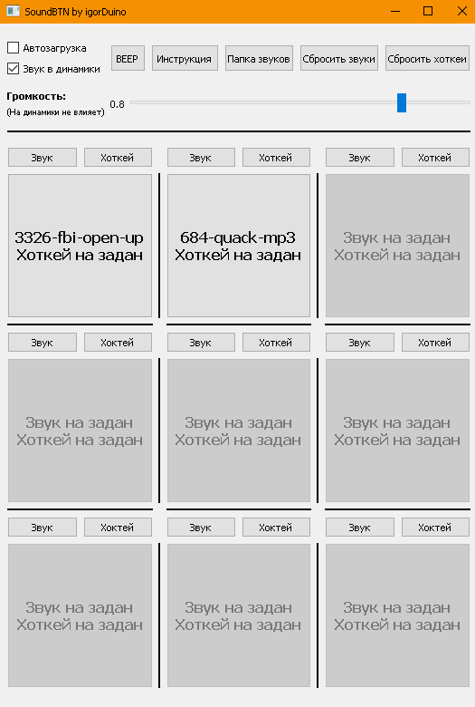

# SoundBTN

#### Play any funny sounds by clicking on a button or phrase while talking to friends or streaming

## The program is at the ALPHA test stage. For any questions, you can write to the mail

### soundbtn@igorkuzmenkov.ru

# Installation

First. Download this git, then
   
Download and install VBCABLE https://vb-audio.com/Cable

For Windows 10, run the VB CABLE_Setup_x64 file and click Install Driver

To mix the sound from the physical microphone and SoundBTN then open "Control Panel" - > "Sound" - > "Record".

   
Then select your microphone, go to "Listen from this device" and select the previously installed VBCABLE. 

Great, now when you choose the line-in VBCABLE as your microphone in a program like Discord or Skype, your interlocutors will perfectly hear both you and the sounds you want to play in the SoundBTN program.

После этого вы можете установить эту программу, поставить те звуки и хоткеи, которые Вам нужны и пользоваться!

